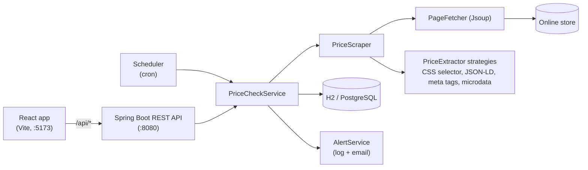

# PriceWatch

**Track product prices and get an alert the moment they drop.**

Paste a product link, set the price you are willing to pay, and PriceWatch checks the page on a schedule,
keeps the full price history, and notifies you when the price reaches your target.


## Table of contents

- [Features](#features)
- [Tech stack](#tech-stack)
- [Architecture](#architecture)
- [Getting started](#getting-started)
  - [Set up accounts (Clerk)](#set-up-accounts-clerk)
  - [Run it from VS Code](#run-it-from-vs-code-recommended)
  - [Run it from the command line](#run-it-from-the-command-line)
  - [Try it without a real store](#try-it-without-a-real-store)
- [Configuration](#configuration)
- [Email alerts](#email-alerts)
- [How price detection works](#how-price-detection-works)
- [REST API](#rest-api)
- [Project structure](#project-structure)
- [Testing](#testing)
- [Troubleshooting](#troubleshooting)
- [Limitations](#limitations)
- [Roadmap](#roadmap)
- [License](#license)

## Features

- **Track any product page.** Paste a URL and a target price. The page is read immediately, so a bad link
  is rejected up front instead of failing silently later.
- **Automatic re-checks.** A scheduler visits every tracked product on a cron schedule (every 12 hours by
  default), one page at a time with a delay between requests.
- **Price history and chart.** Every check is stored. Each product shows its lowest and highest price and an
  interactive chart with your target as a reference line, plus a table view.
- **Try it as a guest, keep it with an account.** Anyone can paste a link and see the price, stock and photo right
  away, without signing in. A guest's product is read once. Signing up (email, Google or GitHub, via Clerk's
  sign-in card) moves the guest's products to the account, where they are checked twice a day and alerts go to
  the account's email. Every account's shelf is private.
- **Smart alerts.** You are alerted once when a price crosses your target, not on every check. The alert
  re-arms after the price rises above the target again. Alerts are logged and, if SMTP is configured, emailed.
- **Back-in-stock alerts.** Availability (in stock, sold out, pre-order) is read on every page, whichever way the
  price was found: from structured data (a product counts as in stock if any size or variant is), from stock
  labels such as Amazon's "In Stock" / "Currently unavailable", from the buy button ("Add to cart" vs "Sold
  out" / "Notify me"), or from short status text near the product. Related-product carousels, reviews and
  size pickers are ignored, and when the page gives no clear answer the status stays unknown rather than
  guessing. It is stored with every check. When a sold-out product is back in stock you get one alert, which
  also says if it is at your price. Sold-out products are labelled on the card and in the history.
- **Works with most shops out of the box.** Prices are read from structured data that shops already publish
  for search engines (schema.org JSON-LD, Open Graph meta tags, microdata). For other sites, give a CSS
  selector for the price element.
- **Failure-tolerant.** If a check fails, the last known price is kept and the card says why in plain words.
  Timeouts, network errors, rate limits and server errors are retried with backoff: a few seconds apart within
  the check, then again after 15, 30, 60 and 120 minutes. A shop that blocks automated checks (HTTP 403, or a
  Cloudflare, DataDome, PerimeterX, Imperva, Akamai or CAPTCHA page) is reported as blocked and not asked again
  early.
- **Responsive, accessible UI.** Light and dark theme, keyboard friendly, chart with a text summary and table
  alternative.

## Tech stack

| Layer    | Technology                                                                                       |
| -------- | ------------------------------------------------------------------------------------------------ |
| Backend  | Java 21, Spring Boot 3.5 (Web, Data JPA, Validation, Mail, OAuth2 Resource Server), Spring Scheduler, Jsoup, Jackson |
| Database | H2 (file mode, zero setup) by default; PostgreSQL via the `postgres` profile                     |
| Frontend | React 19, TypeScript, Vite 8, Recharts, Clerk (`@clerk/react`) for sign-in, plain CSS (no UI framework) |
| Testing  | JUnit 5, AssertJ, Mockito, Spring MockMvc (backend); Oxlint + strict TypeScript (frontend)       |
| CI       | GitHub Actions (backend build and tests, frontend lint and build)                                |

## Architecture



The frontend and backend are independent projects in separate folders. In development, Vite proxies
`/api/*` to the backend, so the browser talks to a single origin and no CORS configuration is needed.

Key design decisions:

- **Strategy pattern for price extraction.** Each way of reading a price is a `PriceExtractor`. `PriceScraper`
  tries them in `@Order` until one finds a price. Supporting a new kind of store means adding one class.
- **No network calls inside database transactions.** `PriceCheckService` scrapes first, then opens a short
  transaction to store the result, so a slow shop never holds a database connection.
- **Alert de-duplication.** An `alertSent` flag on the product implements "notify once per drop", and an
  `awaitingRestock` flag does the same for back-in-stock alerts.
- **Errors as RFC 7807 problem details.** The API returns `application/problem+json`, and the UI shows the
  `detail` text to the user.

## Getting started

### Prerequisites

| Tool                 | Version                 | Notes                                                              |
| -------------------- | ----------------------- | ------------------------------------------------------------------ |
| JDK                  | 21 or newer             | e.g. [Temurin](https://adoptium.net), or local via `setup.sh` ↓   |
| Node.js              | 20.19+ or 22.12+        | Required by Vite 8                                                 |
| Visual Studio Code   | recent                  | With the extensions listed below                                   |
| Apache Maven         | 3.9+ (optional)         | Only for the command line, or local via `setup.sh` ↓              |
| Google Chrome        | recent (optional)       | For JavaScript-rendered shops; downloaded automatically if missing |

#### Optional: project-local JDK and Maven (no global install)

On macOS or Linux you can keep Java and Maven inside the project, similar to a Python venv:

```bash
cd backend
./setup.sh          # downloads Temurin JDK 21 and Maven 3.9.x into backend/.tools (git-ignored)
source activate     # puts them on PATH for the current terminal only
```

Run `source activate` in each new terminal before using `mvn`. Dependencies are stored in `backend/.tools/m2`
instead of `~/.m2`. Run `./setup.sh --force` to update, or delete `backend/.tools` to remove everything.
The VS Code `backend:` tasks activate the local tools automatically when they are present.

### Set up accounts (Clerk)

PriceWatch works without accounts: everyone is a guest, and each product is read once (no re-checks, no alerts).
Accounts are what keep products tracked. Sign-in is handled by [Clerk](https://clerk.com), shown as Clerk's own
sign-in / sign-up card; PriceWatch stores one row per account (`accounts` table), the owner of every product, and
all products and price history in its own database.

1. Create an application at [dashboard.clerk.com](https://dashboard.clerk.com). Under **User & authentication**,
   turn on the sign-in methods you want (the card shows Email, Google and GitHub when they are enabled).
2. Frontend: copy `frontend/.env.example` to `frontend/.env.local` (git-ignored) and set the publishable key:
   ```bash
   VITE_CLERK_PUBLISHABLE_KEY=pk_test_...
   ```
3. Backend: copy `backend/.env.example` to `backend/.env` (git-ignored) and fill in the **Frontend API URL**
   (Dashboard → Configure → API keys) and the secret key:
   ```bash
   CLERK_ISSUER=https://your-app.clerk.accounts.dev
   CLERK_SECRET_KEY=sk_test_...
   ```
   The backend reads this file on start (environment variables with the same names work too). The secret key
   stays on the server; it is only used to look up each account's email for alerts.
4. Restart both, open <http://localhost:5173>: **Sign in** and **Sign up** appear in the header.

How guests and accounts fit together:

- A guest is identified by a random id their browser keeps (`localStorage`). Their products are read once; the card
  offers **Sign up to keep tracking**. Guests can add up to 10 products (`pricewatch.guest.max-products`).
- Signing up or in moves the guest's products to the account; they get their first tracked check within a minute.
- Guest products nobody signs up for are removed after 7 days (`pricewatch.guest.keep-days`).
- If the app is opened from another address than `http://localhost:5173` (your hosting later), add it to
  `pricewatch.auth.clerk.authorized-parties`.

Optional: instead of the secret-key lookup, Clerk can put the email straight into the session token. In the
dashboard, open **Sessions → Customize session token** and add `{"email": "{{user.primary_email_address}}"}`.

> **Upgrading from a version without accounts:** products created before accounts and guests existed belong to
> nobody, so they are deleted (with their price history) the first time this version starts.

### Run it from VS Code (recommended)

1. Open the **repository root folder** (the one containing `backend/` and `frontend/`) in VS Code.
2. Accept the prompt to install the **recommended extensions**
   (Extension Pack for Java, Spring Boot Extension Pack, Oxc). Wait until the Java project has finished
   importing (watch the status bar).
3. Open **Run and Debug** (`Ctrl+Shift+D` / `Cmd+Shift+D`), choose **PriceWatch (Backend + Frontend)**
   and press **F5**.
   This starts Spring Boot on port 8080 and, after running `npm install`, the Vite dev server on port 5173.
4. Open <http://localhost:5173>.

Other launch options in the same dropdown:

| Configuration                                 | Purpose                                                        |
| --------------------------------------------- | -------------------------------------------------------------- |
| Backend (Spring Boot)                         | Backend only, with debugger                                    |
| Frontend (Vite)                               | Frontend only                                                  |
| PriceWatch (fast re-checks)                   | Both, with prices re-checked every minute instead of every 12 h |

Useful tasks (`Terminal > Run Task…`): `backend: test`, `frontend: build`, `frontend: lint`, `start everything`.

### Run it from the command line

Use two terminals.

```bash
# Terminal 1 – backend (http://localhost:8080)
cd backend
source activate    # only if you used ./setup.sh
mvn spring-boot:run
```

```bash
# Terminal 2 – frontend (http://localhost:5173)
cd frontend
npm install
npm run dev
```

Then open <http://localhost:5173>. Stop each process with `Ctrl+C`.

## Configuration

All backend settings live in [`backend/src/main/resources/application.properties`](backend/src/main/resources/application.properties).
Any property can also be set with an environment variable (`pricewatch.scheduler.cron` becomes
`PRICEWATCH_SCHEDULER_CRON`).

| Property                                     | Default                     | Description                                                          |
| -------------------------------------------- | --------------------------- | -------------------------------------------------------------------- |
| `server.port`                                | `8080`                      | Port of the REST API                                                 |
| `spring.datasource.url`                      | `jdbc:h2:file:./data/pricewatch` | Database location (file is created in `backend/data/`)         |
| `pricewatch.scheduler.enabled`               | `true`                      | Turn the background price checks on or off                           |
| `pricewatch.scheduler.cron`                  | `0 0 */12 * * *`            | When to re-check (Spring cron: sec min hour day month weekday)       |
| `pricewatch.scheduler.delay-between-requests-ms` | `1500`                  | Pause between two products, to be polite to shops                    |
| `pricewatch.scheduler.retry.first-delay-minutes` | `15`                    | First early re-check after a temporary failure (then 30, 60, 120)    |
| `pricewatch.scheduler.retry.max-retries`     | `4`                         | Early re-checks before waiting for the regular schedule again        |
| `pricewatch.scraper.timeout-ms`              | `10000`                     | HTTP timeout when downloading a page                                 |
| `pricewatch.scraper.user-agent`              | desktop Chrome string       | User-Agent sent to shops                                             |
| `pricewatch.scraper.retry.max-attempts`      | `3`                         | Downloads per check for timeouts, network errors, HTTP 429 and 5xx   |
| `pricewatch.scraper.retry.initial-backoff-ms`| `1000`                      | Wait before the second download; doubles each time                   |
| `pricewatch.scraper.retry.max-backoff-ms`    | `8000`                      | Longest wait between downloads (a longer `Retry-After` is not waited) |
| `pricewatch.renderer.enabled`               | `true`                      | Fall back to headless Chrome for JavaScript-rendered pages           |
| `pricewatch.renderer.timeout-ms`            | `30000`                     | How long to wait for a rendered page to show its price               |
| `pricewatch.cors.allowed-origins`            | `http://localhost:5173`     | Only needed when the frontend is hosted on another origin            |
| `pricewatch.auth.clerk.issuer`               | `${CLERK_ISSUER}`           | Clerk Frontend API URL; required (see Set up accounts)               |
| `pricewatch.auth.clerk.secret-key`           | `${CLERK_SECRET_KEY}`       | Clerk secret key, for looking up account emails (optional)           |
| `pricewatch.auth.clerk.authorized-parties`   | `http://localhost:5173`     | Origins the app is opened from; tokens for other sites are refused   |
| `pricewatch.alert.to`                        | empty                       | Fallback recipient for owners whose email is not known yet           |
| `pricewatch.alert.from`                      | `pricewatch@localhost`      | Sender address of alert emails                                       |

**Reset all data:** stop the backend and delete the `backend/data/` folder.

**Use PostgreSQL instead of H2:** create an empty database named `pricewatch`, then start the backend with
`SPRING_PROFILES_ACTIVE=postgres` (credentials come from `DB_USERNAME` and `DB_PASSWORD`, both default to
`pricewatch`). Tables are created automatically.

## Email alerts

Alerts are emailed to the owner of the product, at the email of their account. Without SMTP settings they are
only written to the backend log. To send emails, create the git-ignored file
`backend/src/main/resources/application-local.properties`:

```properties
pricewatch.alert.from=you@gmail.com
# only used for accounts whose email is not known yet
pricewatch.alert.to=you@example.com

spring.mail.host=smtp.gmail.com
spring.mail.port=587
spring.mail.username=you@gmail.com
spring.mail.password=your-app-password
spring.mail.properties.mail.smtp.auth=true
spring.mail.properties.mail.smtp.starttls.enable=true
```

and start the backend with the `local` profile: set `SPRING_PROFILES_ACTIVE=local` (in VS Code, add it to the
`env` block of the backend launch configuration). For Gmail, use an
[app password](https://support.google.com/accounts/answer/185833), not your normal password.

## How price detection works

When a product is added or re-checked, `PriceScraper` downloads the page with Jsoup and asks each
`PriceExtractor` in order until one returns a price. If none does, or the shop refuses the plain download, the
page is loaded again in headless Chrome and the same extractors run on the rendered page, so prices that
JavaScript puts on the page (Daraz, for example) are read too:

1. **CSS selector** – only if you supplied one under *Advanced* in the form (for example `.product-price .amount`).
2. **schema.org JSON-LD** – `<script type="application/ld+json">` blocks containing an `Offer`,
   `AggregateOffer` or `priceSpecification`, including nested `@graph` structures.
3. **Microdata** – elements with `itemprop="price"`.
4. **Meta tags** – `product:sale_price:amount`, `product:price:amount`, `og:price:amount` and related tags.
   Checked after microdata because some shops leave the regular price here during a sale.
5. **Price under the title** – for shops that publish no structured data at all: the first price with a currency
   symbol or code shown after the product's `<h1>`. Crossed-out, "was", EMI and per-month prices are skipped.

`PriceParser` turns the text into a number. It understands `$1,299.99`, `1.299,99 €`, `Rs. 1,200`, `12,50` and
similar formats, and detects the currency from an ISO code or symbol. The page title and `og:image` are used for
the product name and thumbnail.

To support a new kind of store, implement `PriceExtractor`, annotate it with `@Component` and `@Order`, and it is
picked up automatically.

## REST API

Base URL: `http://localhost:8080`

Requests come from a signed-in account (`Authorization: Bearer <Clerk session token>`) or a guest
(`X-Guest-Id: <uuid>`); the frontend sends both automatically. An invalid token gets `401`; a request with neither
gets `403` with `"reason": "SIGN_UP_REQUIRED"`, as do guest requests for things only accounts can do (checking
again, more than 10 products). Endpoints work on the caller's own products; anyone else's product answers `404`.
`POST /api/guest/claim` (with both headers) moves the guest's products to the account.

| Method   | Path                          | Description                                                   |
| -------- | ----------------------------- | ------------------------------------------------------------- |
| `GET`    | `/api/products`               | List tracked products with current, lowest and highest price  |
| `POST`   | `/api/products`               | Start tracking a product (reads the page immediately)         |
| `GET`    | `/api/products/{id}`          | Get one product                                               |
| `PUT`    | `/api/products/{id}`          | Change the target price (required) and optionally the name    |
| `DELETE` | `/api/products/{id}`          | Stop tracking and delete the price history                    |
| `GET`    | `/api/products/{id}/history`  | All recorded prices, oldest first                             |
| `POST`   | `/api/products/{id}/check`    | Check the price now                                           |

Example:

```bash
curl -X POST http://localhost:8080/api/products \
  -H "Authorization: Bearer $CLERK_SESSION_TOKEN" \
  -H "Content-Type: application/json" \
  -d '{"url":"https://www.startech.com.bd/benq-gw2491-monitor","targetPrice":13000}'
```

Request fields: `url` (required, http/https), `targetPrice` (required, ≥ 0.01, at most 2 decimals),
`name` (optional), `cssSelector` (optional).

```json
{
  "id": 1,
  "name": "BenQ GW2491 23.8\" Monitor Price in Bangladesh | Star Tech",
  "url": "https://www.startech.com.bd/benq-gw2491-monitor",
  "imageUrl": "https://www.startech.com.bd/image/cache/catalog/monitor/benq/gw2491/gw2491-01-1200x630.webp",
  "currency": "BDT",
  "targetPrice": 13000.00,
  "currentPrice": 13500.00,
  "lowestPrice": 13500.00,
  "highestPrice": 13500.00,
  "belowTarget": false,
  "lastCheckedAt": "2026-09-30T00:15:02.114Z",
  "lastError": null,
  "createdAt": "2026-09-30T00:15:02.114Z"
}
```

Errors use [RFC 7807](https://www.rfc-editor.org/rfc/rfc7807) problem details:

| Status | When                                                    |
| ------ | ------------------------------------------------------- |
| `400`  | Validation failed or the body is not valid JSON         |
| `404`  | Unknown product id                                      |
| `422`  | The page could not be loaded or contains no readable price |

## Project structure

```
pricewatch/
├── backend/                     Spring Boot REST API (Maven)
│   ├── pom.xml
│   ├── setup.sh / activate      optional project-local JDK + Maven (in .tools/, git-ignored)
│   └── src/
│       ├── main/java/com/pricewatch/
│       │   ├── product/         entities, repositories, services, REST controller, DTOs
│       │   ├── scraper/         PageFetcher, PriceScraper, extractors (Strategy), PriceParser
│       │   ├── scheduler/       PriceCheckScheduler (cron)
│       │   ├── alert/           AlertService (log + email)
│       │   ├── config/          CORS
│       │   └── common/          global exception handler (problem details)
│       ├── main/resources/      application.properties, application-postgres.properties
│       └── test/java/           unit and integration tests
├── frontend/                    React + TypeScript app (Vite)
│   ├── package.json
│   └── src/                     api/, components/, hooks/, utils/
├── .vscode/                     launch configurations, tasks, recommended extensions
└── .github/workflows/ci.yml     build and test on every push and pull request
```

## Testing

```bash
# Backend
cd backend
source activate    # only if you used ./setup.sh
mvn test

# Frontend
cd frontend
npm run lint
npm run build      # includes the strict TypeScript type check
```

The backend tests cover:

- price parsing across number formats and currencies,
- each extractor against representative HTML (JSON-LD, `@graph`, aggregate offers, broken JSON, meta tags,
  microdata, CSS selectors, invalid selectors),
- availability from JSON-LD offers, microdata and meta tags,
- the alert rules (alert once per drop, re-arm after recovery, alert once on restock, keep the old price on
  scrape failure),
- retries against a real local HTTP server (backoff, `Retry-After`, no retry when blocked), bot check
  detection, and early re-checks after temporary failures,
- the REST API end to end with MockMvc and an in-memory database.

Network access is mocked in tests, so they run offline.

## Troubleshooting

| Symptom                                                        | Fix                                                                                                      |
| -------------------------------------------------------------- | -------------------------------------------------------------------------------------------------------- |
| No **Sign in** / **Sign up** in the header; cards say "Tracking needs accounts" | Accounts are off. Set the keys as described in [Set up accounts](#set-up-accounts-clerk) and restart both. |
| "Your session has ended" / every call answers `401`            | Sign in again. If it persists, check that `CLERK_ISSUER` matches the app of the publishable key and that the page's address is in `pricewatch.auth.clerk.authorized-parties`. |
| UI shows "Cannot reach the PriceWatch API"                     | The backend is not running, or not on port 8080. Start it and press **Retry**.                           |
| `Port 8080 was already in use`                                 | Stop the other process, or set `server.port` and update the proxy target in `frontend/vite.config.ts`.   |
| `Database may be already in use` (H2 lock)                     | Only one backend instance can open `backend/data/`. Stop the other instance.                             |
| "Could not find a price on that page"                          | PriceWatch already tried headless Chrome. Make sure the link opens a single product, or add a CSS selector under *Advanced*. |
| "… blocks automated checks"                                    | The shop refused the request or showed a bot check, even to headless Chrome. PriceWatch keeps the last price and tries again at the regular check; if every check is blocked, the shop cannot be tracked automatically. |
| "Couldn't reach …"                                             | A timeout, network error or server error after several tries. The card shows when PriceWatch tries again. |
| `Unsupported class file major version` or Java errors in VS Code | Make sure a JDK 21+ is selected (`Java: Configure Java Runtime`).                                      |
| Vite refuses to start                                          | Upgrade Node.js to 20.19+ or 22.12+.                                                                     |

## Limitations

- Pages that build their price with JavaScript are read with headless Chrome, which takes a few seconds per
  page and more memory than a plain download. Pages behind a login, a CAPTCHA or a region block still cannot be
  read.
- Many large retailers forbid automated access in their terms of service or block bots. Check a store's terms
  before tracking it, and keep the check interval modest.
- Sign-in depends on Clerk, a hosted service: without it nobody can sign in, though scheduled price checks keep
  running. Before exposing PriceWatch to the internet, serve it over HTTPS and add its address to
  `pricewatch.auth.clerk.authorized-parties`.

## Roadmap

- [x] Headless-browser fallback for JavaScript-rendered shops
- [ ] Telegram / Discord / webhook notifications
- [x] User accounts and per-user product lists
- [ ] Currency conversion and multi-store comparison for the same product
- [ ] Export price history as CSV
- [ ] Container images and a deployment guide

## License

Released under the [MIT License](LICENSE).
